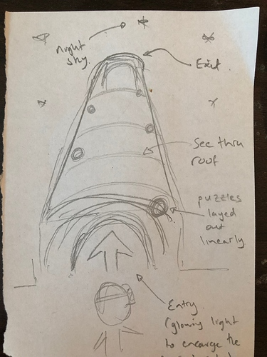
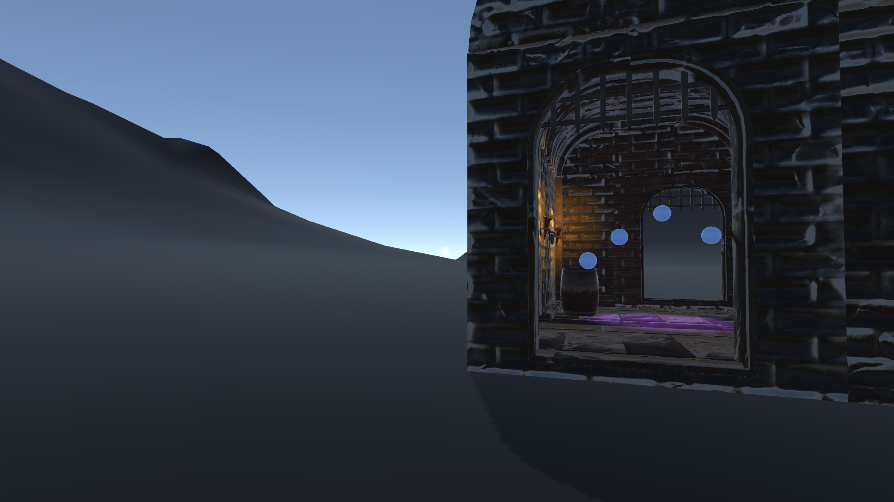
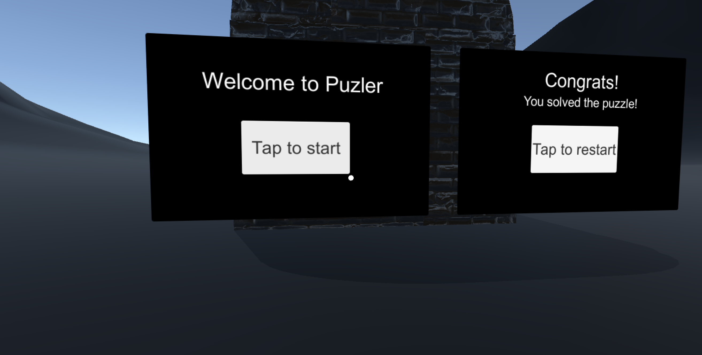
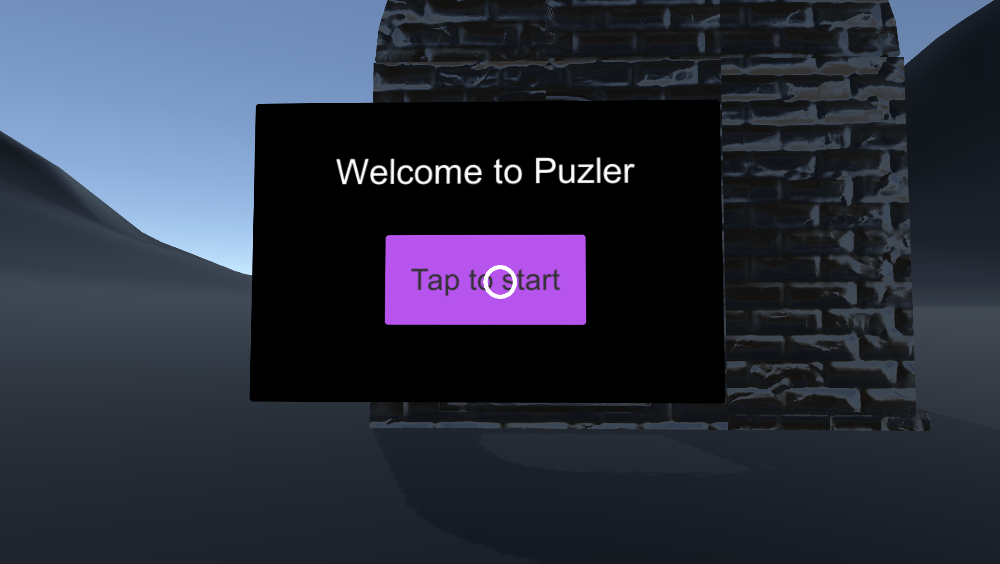
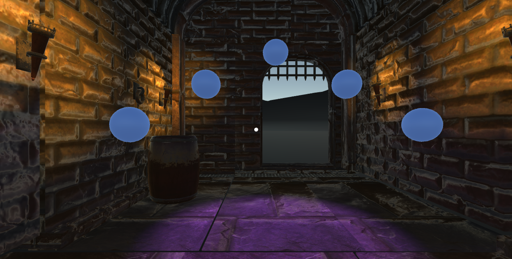

# VR Puzzler 
[Udacity VR Nanodegree project](https://eu.udacity.com/course/vr-developer-nanodegree--nd017)

## Introduction 
The focus of this section of the course (and this project) was on designing VR experience; including the main design tasks, processes, techniques and considerations to create compelling experiences.   Therefore the contents of this document is to encapsulate and present these learnings. 

## Puzzler  
Puzzler is a modified version of the classic [Simon Says]() game where by the player must remember and replay a sequence that was given to her/him. This game varies by placing the user is a mysterious dark world, as to induce anxiety. 

Next we present the fly-thru before walking through the design process. 

## Target Audience 

The target audience for this game were those who have a strong interest in technology and intellectual challenges (puzzles); the proto-persona presented next illustrates the characteristics of a typical user we were targeting (and expecting). 

### Proto- Persona 
 
 
NAME: Dylan Taylor

AGE:
23

OCCUPATION:
Masters student studying bio-engineering

QUOTE:
“If it feels good - do it!”

MOTIVATION:
Dylan is an intelligent techno-junkie - embraces the latest consumer technology and is always on the look out for the next best thing. He gets bored quickly and frequently jumps between interests and has found comfort in experimenting with games to avoid being bored. He is attracted to puzzles and simulations, ideally those that challenge his intellect.

VR EXPERIENCE:
Tried many high-end devices (VIVE, Oculus, and the HoloLens) but only recently obtained a mobile VR headset with the purchase of his new Pixel phone.

## Process 
In this section we will present each stage of the design process; highlighting what each entailed and the interesting points. 

### Concept 

 
As mentioned above; the game is a replica of Simon Says but themed in medieval times. The user enters the world in a dark and lonely environment where their only option is to enter a large empty store room. Within the room the user will be presented with a clsuter of orbs which they much match the given sequence to escape. On exit the player will be presented with the option to play again. 

### Scale, Aesthetics and ambiance

 

In this section the scene was created; with the intention of creating a somewhat mysterious place with little option to explore. This was done by a large empty space and little light, as if it was the dusk of the day. 

#### User Test

**Mood of the room:**
Dark, dungeon like

**Comfort and scale:**
Feels a little small (after some discussion it was revealed that the idea of a dungeon in the user mind is large and spacious - high ceiling)

**Purpose of room:**
I asked what she thought she needed to do; the answer was confusion - wasn’t use what the orbs were for and thought the purpose would be to exit/explore around.

*The dungen was scaled up to make it feel more significant.*

### Interface

 

In this section the main interface was added, giving the player the ability to begin and restart the game. The main points of interest for testing what readibility of the text and placement of the board. 

#### User Test
**Are you able to read the text?** 
Yes

**What do you think you have to do and what do you think happens next?** 
Select the button to start a game. 

### Locomotion

 

Locomotion is concerned with moving the user around the environment whilst avoiding making them feel sick. The technique used was on-rails where the player was navigated between 3 distinct waypoints (start, play and end).

#### User Test
**How did you find the speed** 
A little slow. 

**Was there are sense of nausea** 
No - it was too slow. 

*After testing I tweaked the tween speed and re-tested.*

### Game Play

 

In this section we tested how the user found the game play; observing their understanding of the game rules and difficiulity.   

#### User Test
The user understod the rules and what was required of them. This could have been to how the project was introduced (declaring it was a Simon Says clone). The user took a few times to get the sequence but commented that the game was fun and easy enough. 

## Conclusion 
The exercise highlighted some interesting considerations when designing for VR. Scale and scene become extremely important as the user is immersed into the environment. Another is the challenge of limited (or rather, traditional) peripherals we have come accustomed to when designing and using digital experiences. 

The game itself was simplistic but, again, highlights where we might be with user expectations and ability (given it is a new-ish medium). 

Overall; the game provided a good base to explore the design princples for VR. 

## Next steps  

There are 3 areas I would be interested in exploring: 

* Exploring the use of metaphors, mainly physical, to better assist the user in understanding the affordances of VR. 
* Leverage outward facing cameras (and inside-out tracking) to augment the environment such to adapt the virtual environment to the real-world to allow the user to navigate around freely and confidently. 
* Explore the social element - I believe one of the most benefitical features of VR is it's ability to faciliate presence of other people. 